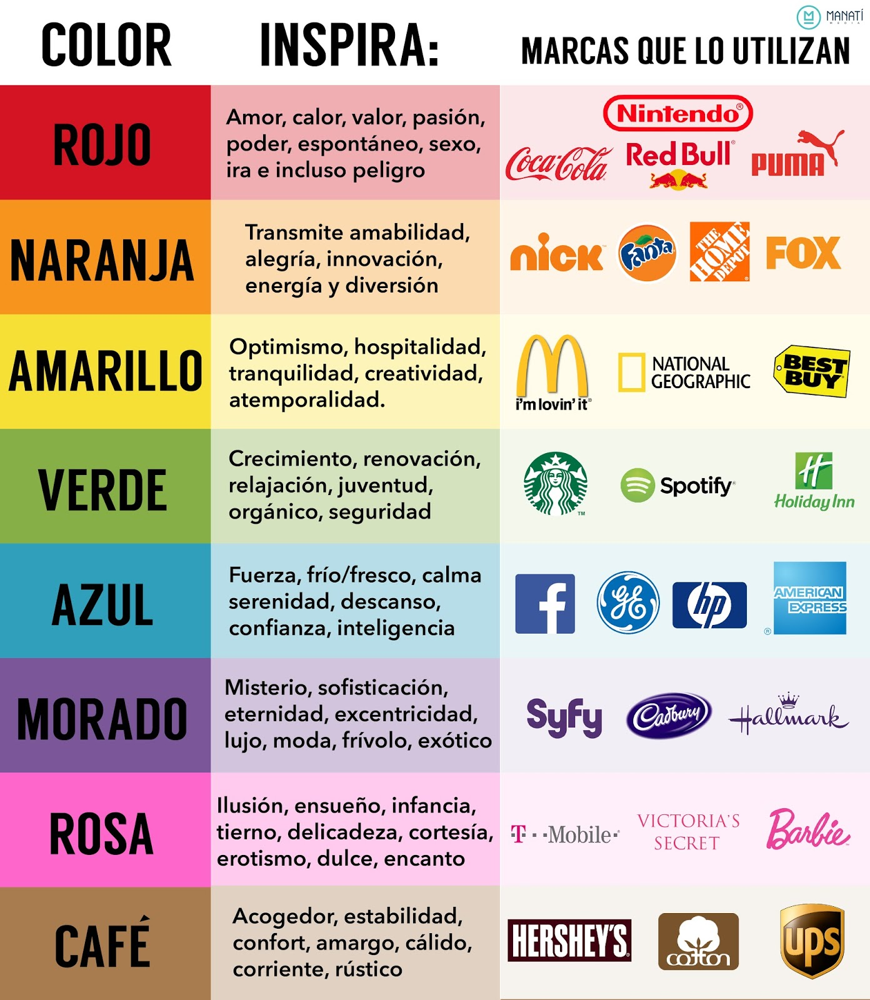

# Diseño Web

El diseño web es el proceso de crear la parte visible de la página web, con la que interactúan nuestros usuarios. Podemos dividir ésta tarea en dos vertientes principales:

* UX (Experiencia de Usuario)
* UI (Interfaz de Usuario)

## UX

La experiencia de Usuario (User eXperience) se centra en mejorar las interacciones entre los usuarios finales y la página web. Se centra en arquitectura de la información, psicología del usuario, pruebas de usabildiad, estrategia de contenidos y diseño de interacción.

Una de las principales herramientas en UX es el Wireframe, una versión de baja fidelidad de nuestro proyecto, basado en las especificaciones del usuario, donde se reflejen todos los apartados importantes para la Experiencia de Usuario, pero sin centrarnos en decisiones de diseño como colores o fuentes.

### Wireframes

Un Wireframe representa de forma sencilla la organización de los elementos de una página web. Podemos crear wireframes con cualquier herramienta de diseño con la que nos encontremos cómodos, ya sean digitales o analógicas.

Por ejemplo, podemos hacer nuestro diseño a mano, con papel y lápiz o con una herramienta de pizarra electrónica.

Nosotros en principio vamos a utilizar una herramienta llamada [Figma](https://figma.com).

El wireframe nos permite simular la interacción que el usuario tendrá con la web, decidir los componentes que la forman, organizar la información pensando en las necesidades del usuario y mucho más.

Es simplemente poner nuestras ideas por escrito.

## UI

En Interfaz de Usuario (User Interface, UI) nos encargamos de la apariencia visual de la página web. Principalmente nos contentramos en decisiones de diseño como colores, tipografía, espacio, uso de elementos pictóricos, etc.

El Interfaz de Usuario es complementario a la Experiencia de Usuario. Una página web puede tener un excelente Interfaz de Usuario y una experiencia de usuario pobre, aunque un buen Interfaz de Usuario contribuye a que la Experiencia de usuario mejore.

### Color

La definición de [Wikipedia](https://es.wikipedia.org/wiki/Color).
> El color es la impresión producida por un tono de luz en los órganos visuales, o más exactamente, es una percepción visual que se genera en el cerebro de los > humanos y otros animales al interpretar las señales nerviosas que le envían los fotorreceptores en la retina del ojo, que a su vez interpretan y distinguen las distintas longitudes de onda que captan de la parte visible del espectro electromagnético.

En diseño web trabajamos para pantallas de ordenador, teléfonos y televisores, con colores de luz, no de tinta. Utilizamos [Síntesis Aditiva](https://es.wikipedia.org/wiki/S%C3%ADntesis_aditiva_de_color) para crear y definir colores los colores.

Todo color es una mezcla de luz Roja, Verde y Azul, RGB por sus siglas en inglés.

Por ejemplo

  +   =   

   +   =   

#### Psicología de los colores

#### Paleta de Colores

Una paleta de colores se compone de una serie de colores que combinan siguiendo algún modelo, derivado de la teoría de colores.

Existen distintas estrategias para generar paletas de colores, en la sección de recursos y herramientas hay una serie de webs dedicadas en exclusiva a generar paletas de colores.

Un ejemplo de paleta de color podría ser: 
| Color                                                 | HEX    |
| ----------------------------------------------------- | ------ |
|  | 5ec281 |
|  | 3b4a3f |
|  | 9eb0a2 |
|  | 00bffe |
|  | 0089c5 |

#### Recursos y Herramientas
##### Herramientas de diseño
* [Figma](https://figma.com)
* [Adobe XD](https://www.adobe.com/es/products/xd.html)
* [Sketch](https://www.sketch.com/)
* [Folios Galgo, 100 unidades](https://www.tintasytoners.es/papel-folios/785-papel-galgo-din-a4-blanco-paquete-100-unidades-100gr-verjurado-profesional-49910-8412742004307.html)
##### Generadores de paletas de colores
* [Adobe Collor](https://color.adobe.com)
* [ColorSpace](https://mycolor.space/)
* [Color Hunt](https://colorhunt.co/)
* [Muzli Colors](https://colors.muz.li/)
##### Gradientes y generadores de gradientes
* [WebGradients](https://webgradients.com/)

##### Inspiración
* [Dribbble](https://dribbble.com/)

##### Fotos y recursos gráficos con derechos fáciles de acomodar
* [Unsplash](https://unsplash.com/)
* [Pixabay](https://pixabay.com/)